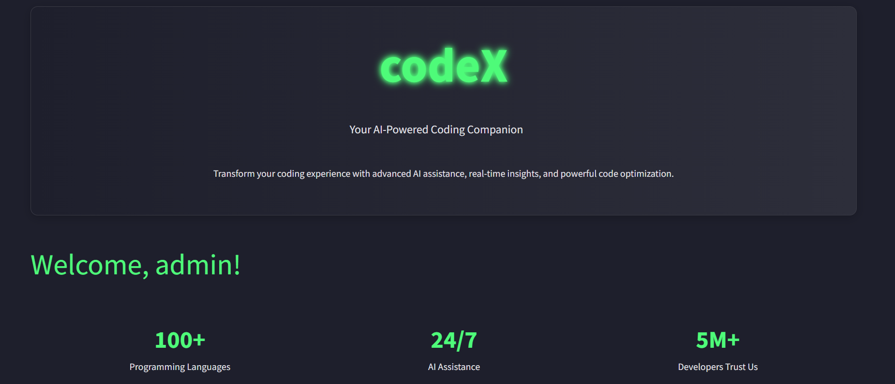
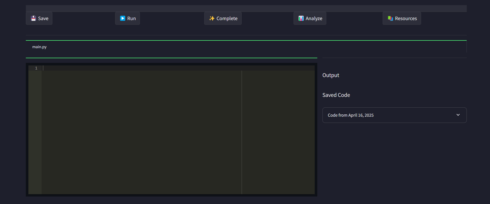
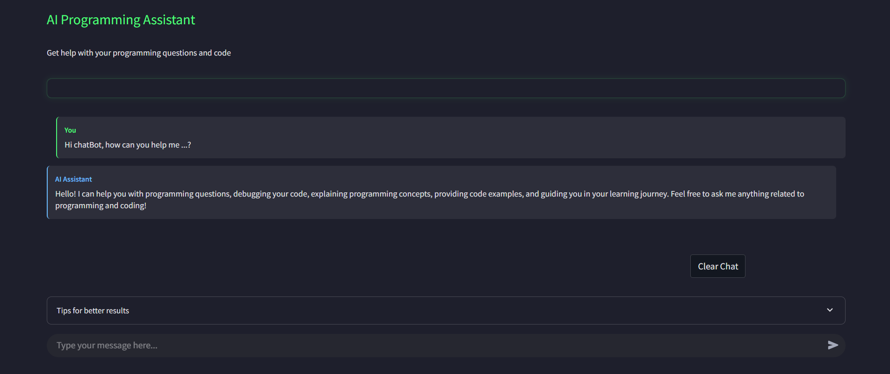

<<<<<<< HEAD
# codeX - AI-Powered Coding Companion

codeX is a modern web application that provides AI assistance for developers, featuring a code editor and AI chatbot to help with programming tasks.

## Screenshots


_The codeX home page featuring animated elements and feature cards_


_The intelligent code editor with syntax highlighting and AI suggestions_


_AI-powered chat interface for programming assistance_

## Features

- **Modern Dark UI**: Sleek dark theme with neon green accents
- **Code Editor**: Write and analyze code with AI assistance
- **AI Chatbot**: Get programming help and guidance instantly
- **User Authentication**: Secure login and registration system

## Local Development

1. Clone this repository
2. Install the required packages:
   ```
   pip install -r requirements.txt
   ```
3. Run the app:
   ```
   streamlit run app.py
   ```

## Deploying on Streamlit Cloud

1. Push your code to a GitHub repository
2. Go to [Streamlit Cloud](https://streamlit.io/cloud)
3. Sign in with your GitHub account
4. Click "New app"
5. Select your repository, branch, and specify `app.py` as the main file
6. Click "Deploy"

Your app will be deployed with a public URL that you can share with others.

## Customization

- Edit the `.streamlit/config.toml` file to change theme colors
- Modify UI components in the respective page files under `pages/`
- Update the navbar in `components/navbar.py`

## Technology Stack

- Streamlit
- OpenAI API
- Python
- HTML/CSS
=======
# codeX-app-v2
>>>>>>> cc06f7a6a4ad79b1113cff164419d7d1fc992938
